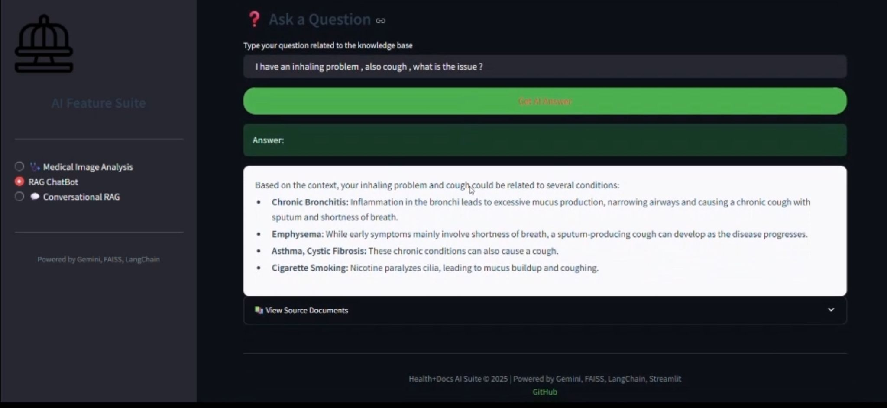
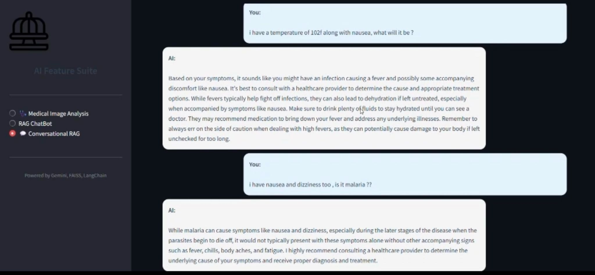
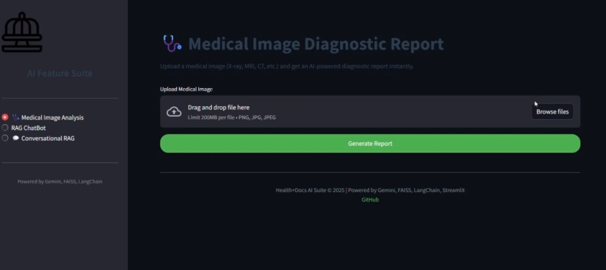
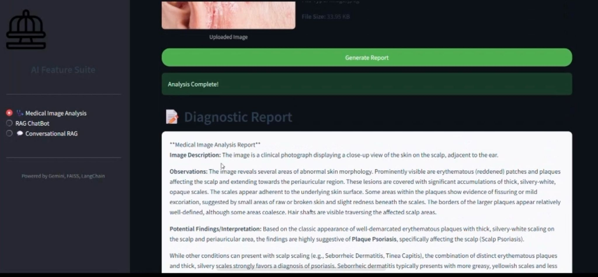

# MedGPT

MedGPT is a **medical reasoning AI system** built using Retrieval-Augmented Generation (RAG) with conversational context memory. The system is designed to answer medical queries using retrieved medical knowledge, a fine-tuned medical LLM, and optional image-based medical analysis.

This project focuses on **grounded medical reasoning**, long-context conversations, and practical LLM system design rather than UI polish.

---

## Key Features

- **LangChain-based RAG pipeline**
- **Conversational RAG** with context memory across turns
- **FAISS vector database** for semantic medical document retrieval
- **Fine-tuned medical reasoning LLM (Mistral + LoRA)**
- **Chain-of-Thought–based prompting and fine-tuning**
- **Medical image analysis module**
- Clear separation of retrieval, memory, and reasoning logic

---
## Demo

### Text-based Medical Reasoning

### Conversational RAG with Context Memory

### Medical Image Analysis

### End-to-End MedGPT Walkthrough

